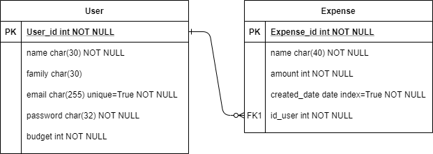

# Flask-app Expenses

Приложение является классическим сайтом, позволяет добавлять/изменять/удалять расходы, а также автоматически высчитывает расходы пользователя за месяц.

- На backend используется: **Flask** .
- на frontend используется: **HTML, CSS, Bootstrap3**.
- В качестве БД : **SQlite3**.
- Для запросов к БД и создание моделей используется: **SQLAlchemy**.

## ER - модель БД:

## Приложение разделено на 3 blueprint'а:

- index_page - основная страница.
- expense - расходы.
- users - пользователи.

В каждом blueprint свои view, form.

## Разработано:
- Регистрация пользователя.
- Логин пользователя.
- Добавление/изменение/удаление расхода.
- Вывод список расходов за месяц, считается сумма расходов и остаток бюджета.
- Сверстаны HTML - страницы, а также формы для внесения/изменения данных пользователя или расходов.
- Созданы модели базы данных, а также запросы к ней.

## requirements:

bcrypt==3.1.7

cffi==1.14.0

Click==7.0

Flask==1.1.1

Flask-Bcrypt==0.7.1

Flask-Login==0.5.0

Flask-SQLAlchemy==2.4.1

Flask-WTF==0.14.3

itsdangerous==1.1.0

Jinja2==2.10.3

MarkupSafe==1.1.1

pycparser==2.20

six==1.14.0

SQLAlchemy==1.3.13

Werkzeug==0.16.0

WTForms==2.2.1

## Разработал: **Михаил Саликов**
## Telegram: **@MikhailSalikov**
## Email: **misha.salikov@yandex.ru**
